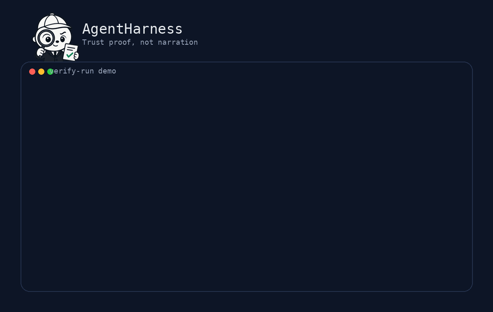

# AgentHarness

<p align="center">
  
</p>

<h3 align="center">Trust proof, not agent narration.</h3>

<p align="center"><strong>A verification layer for coding agents. It reruns what an agent claims and accepts only the results it can prove.</strong></p>

<p align="center">AgentHarness verifies run claims, reexecutes allowed test commands, scores held-out tasks, and separates genuine solution failure from invalid measurement.</p>

<p align="center">
  
  
  
</p>

<p align="center">
  
  
  
  
  
</p>

<table>
<tr>
<td width="25%" align="center" valign="top">

<strong>2 core commands</strong><br />
check for the simple path, verify-run for explicit envelopes

</td>
<td width="25%" align="center" valign="top">

<strong>4 verdicts</strong><br />
supported, unsupported, inconclusive, invalid

</td>
<td width="25%" align="center" valign="top">

<strong>1 trust boundary</strong><br />
real failure versus harness invalid

</td>
<td width="25%" align="center" valign="top">

<strong>0 blind trust</strong><br />
logs alone are not accepted as proof

</td>
</tr>
</table>

<table>
<tr>
<td width="33%" valign="top">

### Proves, not reports
If an agent says tests passed, AgentHarness tries to prove it with controlled reexecution instead of trusting narration.

</td>
<td width="33%" valign="top">

### Scores the real task
Held-out evaluation stays separate from the claims the agent sees, so the benchmark measures outcome, not prompt gaming.

</td>
<td width="33%" valign="top">

### Keeps failure honest
It distinguishes a bad solution from a broken measuring instrument, so invalid grading does not become fake rigor.

</td>
</tr>
</table>

English | Italiano (vai alla [versione italiana](#italiano))

Coding agents report success. They say the tests passed, the scope was respected, the artifact was produced. If you merge on that word alone, a fabricated green run becomes a production bug.

AgentHarness does not trust the report. It reruns the claim, captures what actually happened, and returns a verdict backed by evidence.

It also refuses the opposite mistake. A broken sandbox, missing dependency, or grader fault is a problem of the measurement layer, not of the solution. AgentHarness keeps that boundary explicit so a low score still means something.

AgentHarness does not run agents. It verifies what they claim to have done. It is model-agnostic and agent-agnostic.

---

## See it catch a lie in 60 seconds

<p align="center">
  
</p>

```bash
git clone https://github.com/fabioscialanga/AgentHarness.git
cd AgentHarness
python3 -m venv .venv && . .venv/bin/activate
pip install -e .

# a run whose agent declared a green pytest suite it did not actually pass
agentharness verify-run \
  --run tests/fixtures/run_invite_lie.json \
  --claims tests/fixtures/claims_invite_lie.json \
  --json
```

This case is designed to fail. The run record declares exit code 0, but AgentHarness reruns the allowed command, captures the real non-zero exit code under `.agentharness/evidence/<run_id>/reexecuted/`, and returns `unsupported`.

The success does not survive because the proof does not come from the agent's narration. It comes from controlled reexecution.

To see the clean path:

```bash
agentharness verify-run \
  --run tests/fixtures/run_invite_schema_success.json \
  --claims tests/fixtures/claims_invite_schema.json \
  --json
```

---

## The idea in one line

A raw model is not enough. Reliable agentic engineering needs a harness around it: context, rules, verification, evidence, and a clear boundary between a real failure and an invalid measurement. AgentHarness is that harness, focused on the verification end.

## What it is, and what it is not

What it is:
- a verifier for agent run claims
- a deterministic evaluator for held-out task suites
- an evidence trail for acceptance or rejection
- a boundary between solution failure and harness failure

What it is not:
- not an agent runner
- not a prompt framework
- not a replacement for upstream spec and workflow tooling
- not a system that accepts logs at face value

AgentHarness sits downstream. The agent has already done the work, or claims to have done it. AgentHarness answers the trust question.

## The four verdicts

`verify-run` never guesses. Every claim resolves to one of:

| Verdict | Meaning |
| --- | --- |
| `supported` | The claim is backed by reexecuted or coherent evidence. |
| `unsupported` | Evidence exists and contradicts what the agent declared. |
| `inconclusive` | Truth cannot be defended, so it is not claimed. |
| `invalid` | The envelope is malformed or the harness itself failed. |

That last row is central. AgentHarness separates `real_failure`, a genuine fault of the work, from `harness_invalid`, a fault of the measuring instrument. A benchmark that cannot tell them apart is measuring itself.

---

## Install

Requirements: Python 3.11+ and git.

```bash
git clone https://github.com/fabioscialanga/AgentHarness.git
cd AgentHarness
python3 -m venv .venv && . .venv/bin/activate
pip install -e .
agentharness --help
```

## The product front door

### `agentharness check`

This is the shortest path from an agent claim to independently reexecuted evidence:

```bash
agentharness check \
  --workspace . \
  --command "python -m pytest -q" \
  --json
```

`check` snapshots the workspace under `.agentharness/runs/<run-id>/workspace`, creates the run and claims envelopes, reexecutes the allowed pytest command in that persistent copy, and writes the evidence and verification report. The command never runs in the original workspace.

The current `workspace-copy` executor is mutation isolation, not a security sandbox. It does not block network access or isolate the rest of the host filesystem, and the JSON report says so explicitly.

Use repeated `--allowed-path` and `--forbidden-path` options when changed-file scope is also part of the claim.

### `agentharness verify-run`

This is the lower-level, integration-friendly primitive.

It verifies an agent run against explicit claims and accepts a claim only when controlled proof can defend it.

What it does:
- reruns allowed pytest wrappers such as `pytest`, `python -m pytest`, and `uv run pytest`
- captures the real exit code
- falls back to parsed evidence only when reexecution cannot establish the verdict
- returns `inconclusive` when truth cannot be defended
- rejects malformed envelopes, mismatched run binding, out-of-scope evidence, and evidence parked outside the reserved `.agentharness/evidence/<run_id>/` namespace

If the agent says a test suite passed, AgentHarness does not treat that as proof. It tries to prove it.

## The rest of the surface

- `agentharness evaluate` runs deterministic held-out suites against a run and its workspace. It produces a continuous task score from independent acceptance checks.
- `agentharness verify` checks a project against its contract, checks semantic consistency between `AGENTS.md` and `project.yaml`, and detects drift in checked-in `.framework` artifacts.
- `agentharness run-plan` executes a retry-aware plan with explicit fallbacks and records attempts, outputs, and winner selection as an audit trail.
- `agentharness validate` confirms a project is internally consistent before anything runs.
- `agentharness generate` regenerates deterministic `.framework` governance artifacts from `project.yaml`.
- `agentharness bootstrap` creates a new contract-first project skeleton and validates it.

## Try each command

```bash
# validate, generate, and verify the worked example
agentharness validate examples/civictrack --json
agentharness generate examples/civictrack --json
agentharness verify   examples/civictrack --json

# deterministic held-out evaluation
agentharness evaluate \
  --run examples/cookbooks/evaluation-demo/run.json \
  --suite examples/cookbooks/evaluation-demo/suite.json \
  --json

# retry and fallback with an audit trail
agentharness run-plan \
  --plan examples/cookbooks/retry-fallback-demo/plan.json \
  --json

# start a new contract-first project
agentharness bootstrap ./my-project \
  --project-name "My Project" \
  --project-slug my-project \
  --json
```

## Where AgentHarness fits

Spec-driven frameworks help an agent start well. They turn intent into structure and give the agent rules before execution.

AgentHarness sits later in the chain, where somebody has to decide whether the result is trustworthy. It reruns claims, judges behavior with held-out checks kept separate from what the agent sees, distinguishes a real solution failure from a harness fault, and leaves an auditable evidence trail.

The two layers are complementary. One helps generate the work. This one helps decide whether to trust the outcome.

## Project building blocks

- `PROJECT.md`: human-readable project intent
- `project.yaml`: structured, machine-readable project config
- `AGENTS.md`: agent operating rules
- `workflows/`, `checklists/`, `policies/`: task templates, review rules, testing rules, and guardrails
- `.framework/`: generated metadata, risk matrices, required checks

## Honest status

A verification project should be the last to overclaim.

Works today:
- one-command workspace checking with automatic run/claims envelopes and a persistent workspace-copy evidence bundle
- claim-based run verification with controlled reexecution
- deterministic held-out evaluation suites
- the `real_failure` and `harness_invalid` taxonomy
- an offline, reproducible grading environment
- a pre-registered A/B benchmark methodology
- one worked example, runnable cookbooks, and automated tests for the core flows

Not yet:
- `workspace-copy` keeps ordinary relative command writes in the snapshot but is not yet a network/filesystem security sandbox
- benchmark tasks currently target Python, FastAPI, and CLI
- the full A/B campaign result is not published yet
- out-of-the-box CI and vendor runtime integration are still limited
- project-template coverage is still narrow

## Documentation

- Quickstart: `docs/en/QUICKSTART.md`
- Project documentation: `docs/en/PROJECT_DOCUMENTATION.md`
- Validator: `docs/en/VALIDATOR.md`
- Bootstrap: `docs/en/BOOTSTRAP.md`
- A/B benchmark: `docs/en/AB_BENCHMARK.md`
- Worked example: `docs/en/EXAMPLE_CIVICTRACK.md`

---

<a name="italiano"></a>

# AgentHarness (Italiano)

**Uno strato di verifica per agenti di coding. Riesegue cio che un agente dichiara e accetta solo i risultati che puo dimostrare.**

Gli agenti di coding dichiarano successo. Dicono che i test passano, che lo scope e stato rispettato, che l'artefatto e stato prodotto. Se si fonde sulla sola parola, un falso verde diventa un bug in produzione.

AgentHarness non si fida del report. Riesegue il claim, cattura cio che e successo davvero e restituisce un verdetto sostenuto dall'evidenza.

Rifiuta anche l'errore opposto. Una sandbox rotta, una dipendenza mancante o un guasto del grader sono problemi dello strumento di misura, non della soluzione. AgentHarness mantiene questo confine esplicito, cosi un punteggio basso continua a significare qualcosa.

AgentHarness non esegue agenti. Verifica cio che dichiarano di aver fatto. E indipendente dal modello e dall'agente.

## Vedilo smascherare una bugia in 60 secondi

```bash
git clone https://github.com/fabioscialanga/AgentHarness.git
cd AgentHarness
python3 -m venv .venv && . .venv/bin/activate
pip install -e .

agentharness verify-run \
  --run tests/fixtures/run_invite_lie.json \
  --claims tests/fixtures/claims_invite_lie.json \
  --json
```

Questo caso e costruito per fallire. Il run record dichiara exit code 0, ma AgentHarness riesegue il comando consentito, cattura il vero exit code diverso da zero sotto `.agentharness/evidence/<run_id>/reexecuted/` e restituisce `unsupported`.

Il successo non regge perche la prova non arriva dal racconto dell'agente. Arriva dalla riesecuzione controllata.

Per vedere il percorso pulito:

```bash
agentharness verify-run \
  --run tests/fixtures/run_invite_schema_success.json \
  --claims tests/fixtures/claims_invite_schema.json \
  --json
```

## L'idea in una riga

Un modello grezzo non basta. L'ingegneria agentica affidabile richiede un harness intorno: contesto, regole, verifica, evidenza e un confine chiaro tra fallimento reale e misura invalida. AgentHarness e quel layer, concentrato sul lato verifica.

## Cosa e, e cosa non e

Cosa e:
- un verificatore di claim su run di agenti
- un valutatore deterministico per suite held-out
- una traccia di evidenza per accettare o rifiutare un risultato
- un confine tra fallimento della soluzione e fallimento dell'harness

Cosa non e:
- non e un agent runner
- non e un prompt framework
- non sostituisce i tool a monte per specifica e workflow
- non accetta i log come prova sufficiente

AgentHarness sta a valle. L'agente ha gia fatto il lavoro, o sostiene di averlo fatto. AgentHarness risponde alla domanda sulla fiducia.

## I quattro verdetti

`verify-run` non indovina. Ogni claim finisce in una di queste categorie:

| Verdetto | Significato |
| --- | --- |
| `supported` | Il claim e sostenuto da evidenza rieseguita o coerente. |
| `unsupported` | L'evidenza esiste e contraddice cio che l'agente ha dichiarato. |
| `inconclusive` | La verita non e difendibile, quindi non viene dichiarata. |
| `invalid` | L'envelope e malformato oppure ha fallito l'harness. |

L'ultima riga e il centro del progetto. AgentHarness separa `real_failure`, un guasto vero del lavoro, da `harness_invalid`, un guasto dello strumento di misura. Un benchmark che non sa distinguerli sta misurando se stesso.

## Installazione

Requisiti: Python 3.11+ e git.

```bash
git clone https://github.com/fabioscialanga/AgentHarness.git
cd AgentHarness
python3 -m venv .venv && . .venv/bin/activate
pip install -e .
agentharness --help
```

## La porta di ingresso del prodotto

### `agentharness check`

Questo e il percorso piu breve dalla dichiarazione dell'agente a una prova rieseguita in modo indipendente:

```bash
agentharness check \
  --workspace . \
  --command "python -m pytest -q" \
  --json
```

`check` crea uno snapshot sotto `.agentharness/runs/<run-id>/workspace`, genera automaticamente gli envelope run e claims, riesegue il comando pytest consentito nella copia persistente e scrive evidenze e report. Il comando non viene eseguito nel workspace originale.

L'executor attuale `workspace-copy` isola le modifiche, ma non e un security sandbox: non blocca la rete e non isola il resto del filesystem host. Il report JSON lo dichiara esplicitamente.

Le opzioni ripetibili `--allowed-path` e `--forbidden-path` aggiungono anche la verifica dello scope dei file modificati.

### `agentharness verify-run`

E la primitive di livello inferiore per integrazioni ed envelope espliciti.

Verifica una run rispetto a claim espliciti e accetta un claim solo quando una prova controllata puo sostenerlo.

Cosa fa:
- riesegue i wrapper pytest consentiti, per esempio `pytest`, `python -m pytest` e `uv run pytest`
- cattura il vero exit code
- ripiega sull'evidenza analizzata solo quando la riesecuzione non basta a decidere
- restituisce `inconclusive` quando la verita non e difendibile
- rifiuta envelope malformati, binding run-claim incoerenti, evidenza fuori scope ed evidenza salvata fuori dal namespace riservato `.agentharness/evidence/<run_id>/`

Se l'agente dichiara che una suite e verde, AgentHarness non lo tratta come prova. Prova a dimostrarlo.

## Il resto della superficie

- `agentharness evaluate` esegue suite held-out deterministiche contro una run e il suo workspace. Produce uno score continuo da controlli di accettazione indipendenti.
- `agentharness verify` controlla un progetto rispetto al contratto, controlla la coerenza semantica tra `AGENTS.md` e `project.yaml` e rileva drift negli artefatti `.framework` versionati.
- `agentharness run-plan` esegue un piano con retry e fallback espliciti e registra tentativi, output e selezione del vincitore come audit trail.
- `agentharness validate` conferma che un progetto sia internamente coerente prima di eseguire altro.
- `agentharness generate` rigenera gli artefatti `.framework` deterministici a partire da `project.yaml`.
- `agentharness bootstrap` crea un nuovo skeleton contract-first e lo valida.

## Prova i comandi

```bash
agentharness validate examples/civictrack --json
agentharness generate examples/civictrack --json
agentharness verify   examples/civictrack --json

agentharness evaluate \
  --run examples/cookbooks/evaluation-demo/run.json \
  --suite examples/cookbooks/evaluation-demo/suite.json \
  --json

agentharness run-plan \
  --plan examples/cookbooks/retry-fallback-demo/plan.json \
  --json

agentharness bootstrap ./my-project \
  --project-name "My Project" \
  --project-slug my-project \
  --json
```

## Dove si colloca AgentHarness

I framework spec-driven aiutano l'agente a partire bene. Trasformano l'intento in struttura e forniscono regole prima dell'esecuzione.

AgentHarness sta piu avanti nella catena, nel punto in cui qualcuno deve decidere se il risultato e affidabile. Riesegue i claim, giudica il comportamento con controlli held-out separati da cio che l'agente vede, distingue tra fallimento reale della soluzione e guasto dell'harness, e lascia una traccia di evidenza auditabile.

I due layer sono complementari. Uno aiuta a generare il lavoro. Questo aiuta a decidere se fidarsi del risultato.

## Blocchi del progetto

- `PROJECT.md`: intento del progetto leggibile da umani
- `project.yaml`: configurazione strutturata e machine-readable
- `AGENTS.md`: regole operative per agenti
- `workflows/`, `checklists/`, `policies/`: template di task, regole di review, test e guardrail
- `.framework/`: metadata generati, matrici di rischio, controlli richiesti

## Stato onesto

Un progetto sulla verifica dovrebbe essere l'ultimo a promettere troppo.

Funziona oggi:
- controllo one-command del workspace con envelope run/claims automatici e bundle di evidenza persistente su copia del workspace
- verifica di run basata su claim con riesecuzione controllata
- suite held-out deterministiche
- tassonomia `real_failure` e `harness_invalid`
- ambiente di grading offline e riproducibile
- metodologia A/B pre-registrata
- un esempio completo, cookbook eseguibili e test automatici per i flussi principali

Non ancora:
- `workspace-copy` mantiene nella copia le normali scritture relative del comando, ma non e ancora un security sandbox di rete/filesystem
- i task del benchmark oggi coprono soprattutto Python, FastAPI e CLI
- il risultato completo della campagna A/B non e ancora pubblicato
- l'integrazione pronta all'uso con CI e runtime dei vendor e ancora limitata
- la copertura dei template di progetto e ancora stretta

## Documentazione

- Quickstart: `docs/it/QUICKSTART.md`
- Documentazione del progetto: `docs/it/DOCUMENTAZIONE_PROGETTO.md`
- Validatore: `docs/it/VALIDATORE.md`
- Bootstrap: `docs/it/BOOTSTRAP.md`
- Benchmark A/B: `docs/it/BENCHMARK_AB.md`
- Esempio completo: `docs/it/ESEMPIO_CIVICTRACK.md`
